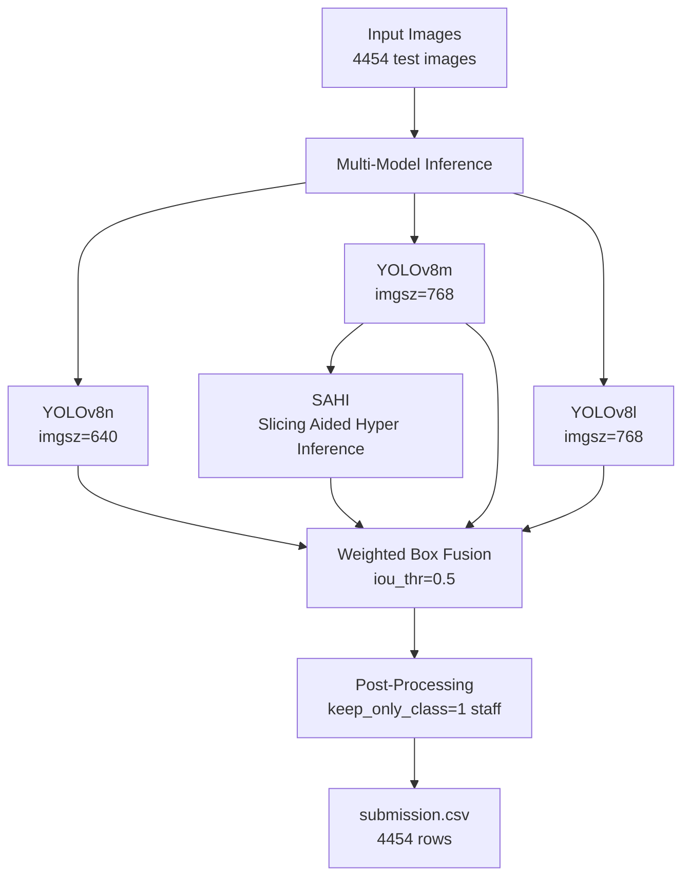

<div align="center">


# Детекция сотрудников сети магазинов X5

[](https://kaggle.com)
[](https://opensource.org/licenses/Apache-2.0)

</div>

## 📋 Содержание

- [О проекте](#-о-проекте)
- [Постановка задачи](#-постановка-задачи)
- [Архитектура решения](#-архитектура-решения)
- [Технический стек](#-технический-стек)
- [Результаты](#-результаты)
- [Установка и запуск](#-установка-и-запуск)
- [Структура проекта](#-структура-проекта)
- [Ключевые особенности](#-ключевые-особенности)

## 📖 О проекте
Данный репозиторий содержит решение задачи детекции объектов. Основная цель — разработка эффективного пайплайна для локализации людей на изображениях с видеопотока и их классификации на два класса: customer (покупатель) и staff (сотрудник).

> Финальная метрика: точность детекции только класса staff для submission.csv

## 🎯 Постановка задачи
- **Входные данные**: Набор изображений разрешением 1280x720 пикселей.
Классы:

    `customer` (class_id: 0) \
    `staff` (class_id: 1)

- **Целевая метрика**: `mAP` (mean Average Precision) для класса `staff`.
- **Ограничение**: Финальный файл сабмишн (`submission.csv`) должен содержать координаты `bounding boxes` только для класса `staff`.

## 🏗 Архитектура решения



## 🛠 Технический стек
### Основные фреймворки и библиотеки
<div align="center">
  
  | Компонент | Версия | Назначение |
  |-----------|--------|------------|
  | Python | 3.12.12 | Язык программирования |
  | PyTorch | 2.9.0+cu126 | Deep Learning фреймворк |
  | Ultralytics | 8.4.19 | YOLOv8 архитектура |
  | CUDA | 12.6 | GPU ускорение |
  
</div>

### Ключевые зависимости

```bash
ultralytics==8.4.19      # YOLOv8 модели
sahi                     # Slicing Aided Hyper Inference
ensemble-boxes           # Weighted Box Fusion
pandas                   # Работа с данными
numpy                    # Численные вычисления
tqdm                     # Прогресс-бары
pyyaml                   # YAML конфигурации
albumentations           # Аугментации изображений
```

### Методы улучшения качества
- **Ensemble**: Weighted Box Fusion (WBF) с параметрами `iou_thr=0.5`, `skip_box_thr=0.001`
- **SAHI**: Slicing Aided Hyper Inference для детекции мелких объектов
- **Multi-scale**: Инференс на разных размерах изображений (640, 768)
- **Checkpoints**: Сохранение и возобновление обучения (best.pt)

## 📊 Результаты
### Метрики моделей на валидации
<div align="center">

| Модель | Размер | Image Size | Epochs | mAP |
|--------|--------|------------|--------|-----|
| YOLOv8n | Nano | 640 | 25 | ~0.769 |
| YOLOv8m | Medium | 768 | 40 | ~0.792 |
| YOLOv8l | Large | 768 | 40 | ~0.845 |

</div>

### Детальные метрики лучшей модели (YOLOv8l)
```
Class      Images  Instances  Box(P      R      mAP50  mAP50-95)
all        3908    21119      0.953    0.904    0.956    0.811
customer   3481    17061      0.939    0.888    0.948    0.783
staff      3089     4058      0.977    0.961    0.985    0.908
```

## 🚀 Установка и запуск
### 1. Установка зависимостей
```
pip install ultralytics==8.4.19
pip install sahi
pip install ensemble-boxes
pip install pandas numpy tqdm pyyaml albumentations
```

### 2. Подготовка данных
```python
# Автоматическая коррекция путей в YAML-конфигурации
DATA_YAML = "/kaggle/working/data_fixed.yaml"
TEST_DIR = "/kaggle/input/competitions/dl-lab-2-stuff-detection/test_images/test_images"
```

### 3. Обучение моделей
```python
# Модель 1: YOLOv8n (baseline)
ckpt1 = train_with_resume(
    ckpt_name="yolo26n_best.pt",
    base_weights="yolo26n.pt",
    project_name="miet",
    run_name="lab2_yolo26n",
    first_epochs=25,
    extra_epochs=10,
    imgsz=640,
    batch=16
)

# Модель 2: YOLOv8m
ckpt2 = train_with_resume(
    ckpt_name="yolov8m_best.pt",
    base_weights="yolov8m.pt",
    project_name="miet",
    run_name="lab2_yolov8m",
    first_epochs=40,
    extra_epochs=10,
    imgsz=768,
    batch=16
)

# Модель 3: YOLOv8l (лучшая точность)
ckpt3 = train_with_resume(
    ckpt_name="yolov8l_best.pt",
    base_weights="yolov8l.pt",
    project_name="miet",
    run_name="lab2_yolov8l",
    first_epochs=40,
    extra_epochs=10,
    imgsz=768,
    batch=8
)
```

### 4. Инференс и ансамблирование
```python
# Предсказания для всех моделей
labels1 = predict_and_save_txt("yolo26n_best.pt", "pred_yolo26n", imgsz=640)
labels2 = predict_and_save_txt("yolov8m_best.pt", "pred_yolov8m", imgsz=768)
labels3 = predict_and_save_txt("yolov8l_best.pt", "pred_yolov8l", imgsz=768)

# SAHI инференс для лучшей модели
run_sahi_on_test(detection_model, TEST_DIR, SAHI_TXT_DIR)

# Weighted Box Fusion
boxes_wbf, scores_wbf, labels_wbf = weighted_boxes_fusion(
    all_boxes, all_scores, all_labels,
    iou_thr=0.5,
    skip_box_thr=0.001
)

# Генерация submission.csv (только staff)
build_submission_from_solution_order(
    solution_csv=SAMPLE_SUB,
    preds_dir=str(ENSEMBLE_TXT_DIR),
    output_csv="submission.csv",
    keep_only_class=1  # staff
)
```
